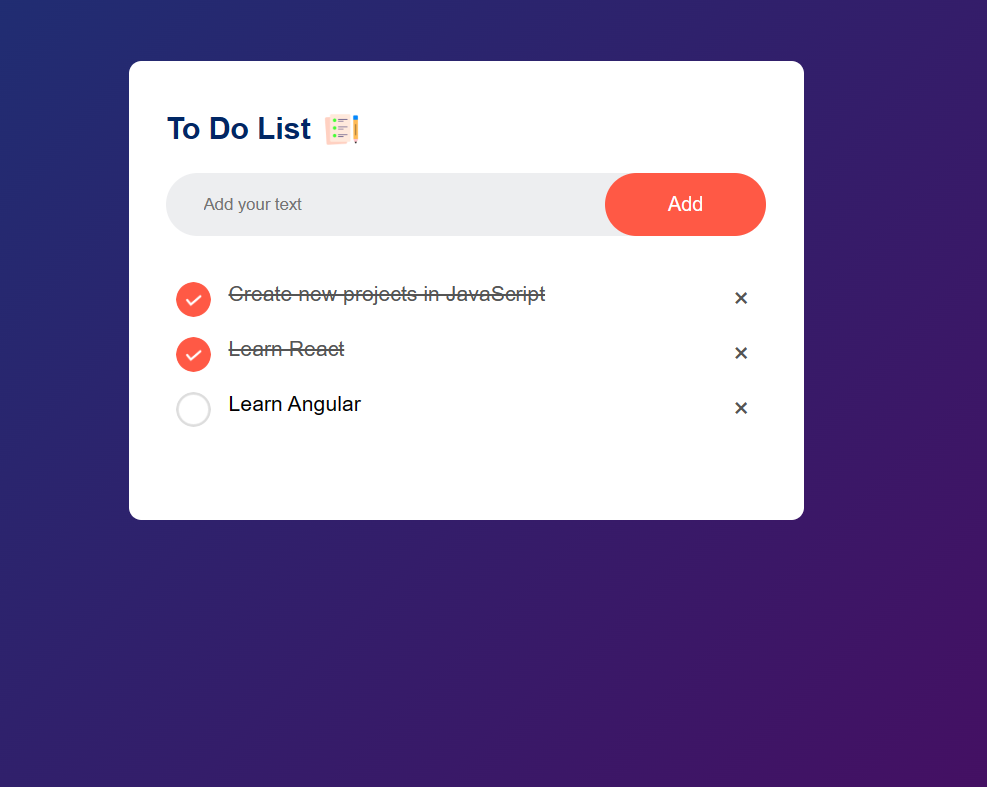
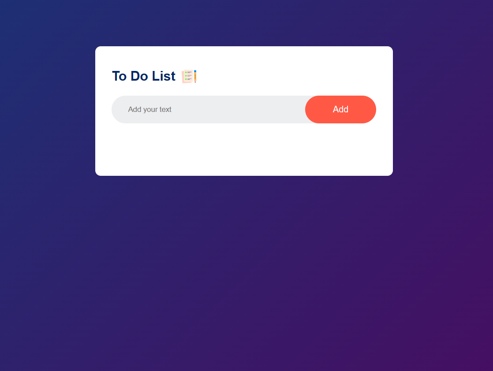

## Interactive To-Do List

Welcome to the Interactive To-Do List – a dynamic web application that empowers you to efficiently manage your tasks with interactive features.

## Interactive To-Do List Screenshot

## Features

    Add Tasks: Effortlessly add new tasks using the input box and the "Add" button.
    Mark as Complete: Simply click on a task to mark it as completed. The task text will be elegantly crossed out, indicating its completion status.
    Delete Tasks: Remove tasks from your list by clicking the delete (✖) button beside each task.
    Local Storage: Enjoy the convenience of local storage, ensuring your tasks persist even when you close the browser.
    Responsive Design: Experience the app seamlessly on various devices, from spacious desktops to on-the-go mobile devices.

## Usage

    Launch the index.html file in any web browser.
    Utilize the input box to effortlessly add a new task.
    Click the "Add" button or simply press Enter to seamlessly add the task to your list.
    A simple click on a task marks it as complete or incomplete.
    By clicking the delete (✖) button next to a task, you can efficiently remove it from your list.
    Your tasks are diligently saved locally, ensuring that you can close the browser and return later to see your list just as you left it.

## Screenshots

## Contribution

Contributions are warmly welcomed! If you encounter any issues or have suggestions for improvements, please don't hesitate to open an issue or submit a pull request. Let's make this app even better together!
